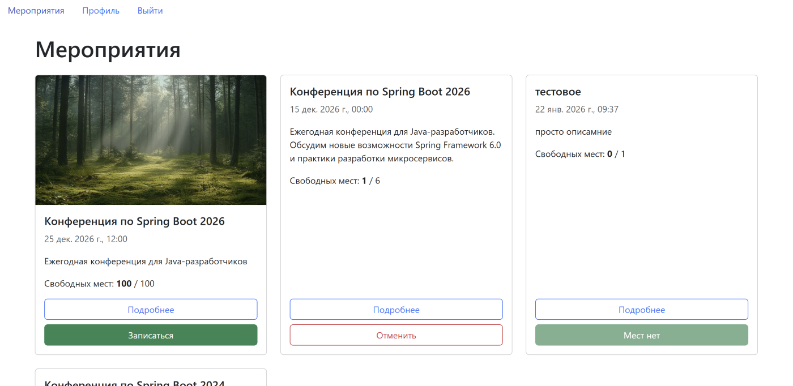
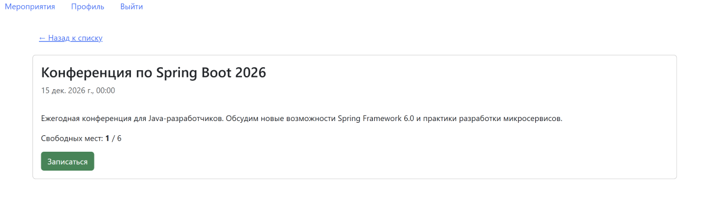
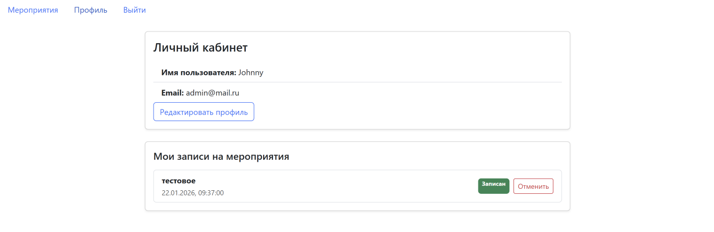
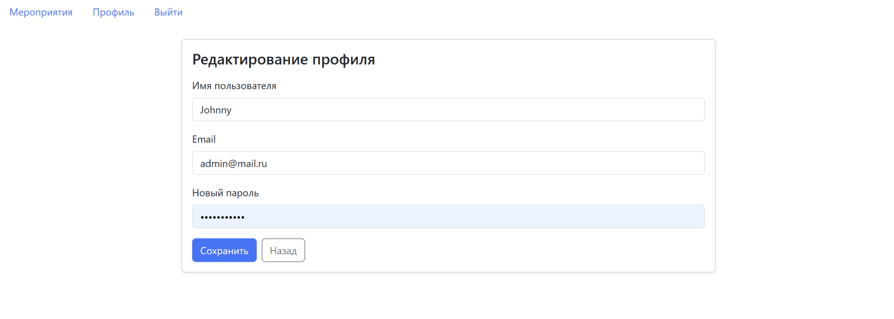
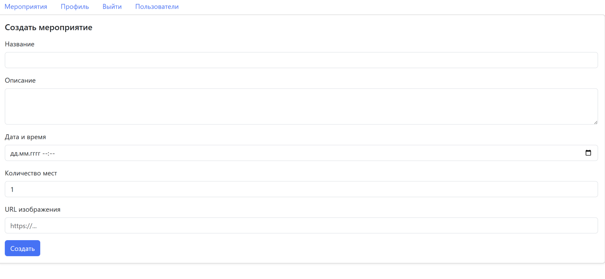
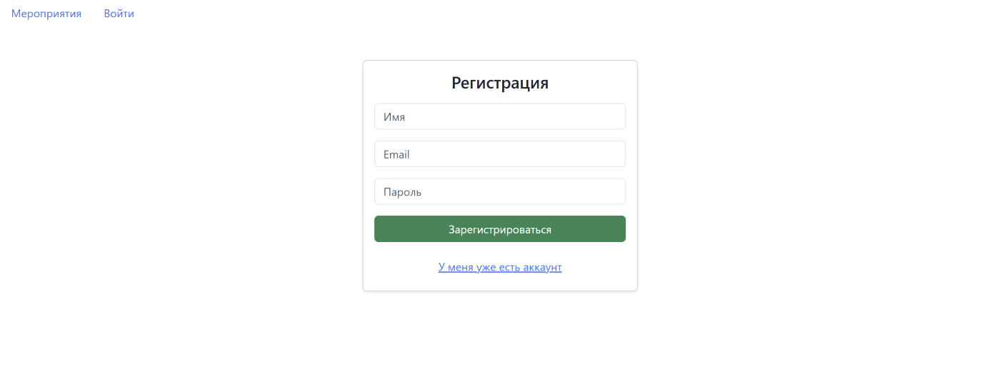

# Event Management System

Веб-приложение для управления мероприятиями с регистрацией пользователей и ролевой моделью доступа.

Проект создан в учебно-практических целях для отработки навыков Java Backend-разработки: проектирования REST API, работы с базой данных, валидации данных и реализации бизнес-логики.

---

## Функциональность

### Пользователи
- регистрация и аутентификация по токену
- просмотр личного кабинета
- запись и отмена записи на мероприятия

### Мероприятия
- просмотр списка мероприятий
- просмотр детальной информации о мероприятии
- регистрация на мероприятие
- автоматический контроль количества доступных мест

### Администрирование (роль ADMIN)
- создание мероприятий
- редактирование мероприятий
- удаление мероприятий
- доступ к списку пользователей

---

## Технологии

### Backend
- Java 17
- Spring Boot
- Spring MVC
- Authentication: custom token-based auth
- Password hashing (BCrypt)
- Spring Data JPA (Hibernate как провайдер)
- Bean Validation
- PostgreSQL 

### Frontend
- Vue 3
- Composition API
- Fetch API
- Bootstrap 5

---

## Архитектура

- REST API
- разделение на Controller / Service / Repository
- DTO для входящих и исходящих данных
- маппинг сущностей через mapper
- валидация данных на уровне DTO
- проверка прав доступа и бизнес-ограничений на backend

---

## API Endpoints
### Auth
- POST /auth/register — регистрация пользователя
- POST /auth/login — вход в систему

- POST /auth/logout — выход из системы (инвалидация токена)

### Users
- GET /users — список всех пользователей
- GET /users/me — данные текущего пользователя
- PUT /users/me — обновление профиля
- DELETE /users/me — удаление аккаунта

### Events
- GET /events — список мероприятий
- GET /events/{id} — получение мероприятия по id
- POST /events — создание мероприятия (admin)
- PUT /events/{id} — обновление мероприятия (admin)
- DELETE /events/{id} — удаление мероприятия (admin)

### Registrations
- POST /events/{eventId}/register — запись на мероприятие
- DELETE /events/{eventId}/register — отмена записи
- GET /users/me/registrations — мои записи на мероприятия
- GET /events/{eventId}/registrations — участники мероприятия (admin)
- GET /events/{eventId}/registrations/me — проверка записи текущего пользователя

---
## Скрины

### Список мероприятий


### Детали мероприятия


### Личный кабинет


### Обновление профиля


### Создание мероприятия 


### Регистрация

---

## Запуск проекта

### Backend
1. Перейти в папку `main/java/mamonova/com/events`
2. Запустить Spring Boot приложение (через IDE или `mvn spring-boot:run`)
3. Backend будет доступен на `http://localhost:8081`

### Frontend
1. Перейти в папку `frontend`
2. Установить зависимости:
   ```bash
   npm install
3. Запустить приложение:
    ```bash
   npm run dev
4. Frontend будет доступен на `http://localhost:3000`

---

## API Documentation

Swagger UI доступен по адресу:
`http://localhost:8081/swagger-ui.html`